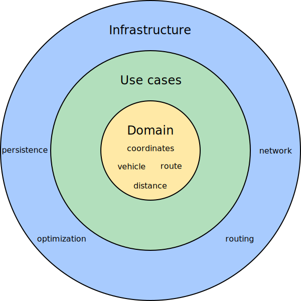

[appendix]
[[backend-architecture]]
= Back end architecture

Domain model and use cases are essential for the application.
We put domain model at the center of the architecture and surround it by the application layer that embeds use cases.
Functions such as route optimization, distance calculation, persistence, and network communication are considered implementation details
and are placed at the outermost layer of the architecture.

.Diagram of application layers

== Code organization

The back end code is organized in three layers outlined above.

[literal]
....
org.optaweb.vehiclerouting
├── domain
├── plugin          # Infrastructure layer
│   ├── persistence
│   ├── planner
│   ├── routing
│   └── websocket
└── service         # Application layer
    ├── demo
    ├── distance
    ├── location
    ├── region
    ├── reload
    ├── route
    └── vehicle
....

The `service` package contains the application layer that implements use cases.
The `plugin` package contains the infrastructure layer.

Code in each layer is further organized by function.
This means that each service or plugin has its own package.

== Dependency rules

Compile-time dependencies are only allowed to point from outer layers towards the center.
Following this rule helps to keep the domain model independent of underlying frameworks and other implementation details and model the behavior of business entities more precisely.
With presentation and persistence being pushed out to the periphery, it is easier to test the behavior of business entities and use cases.

The domain has no dependencies.

Services only depend on the domain.
If a service needs to send a result (for example to the database or to the client), it uses an output boundary interface.
Its implementation is injected by the https://quarkus.io/guides/cdi[CDI container].

Plugins depend on services in two ways.
Firstly, they invoke services based on events such as a user input or a route update coming from the optimization engine.
Services are injected into plugins which moves the burden of their construction and dependency resolution to the IoC container.
Secondly, plugins implement service output boundary interfaces to handle use case results, for example persisting changes to the database or sending a response to the web UI.

== The `domain` package

The `domain` package contains _business objects_ that model the domain of this project, for example `Location`, `Vehicle`, `Route`.
These objects are strictly business-oriented and must not be influenced by any tools and frameworks, for example object-relational mapping tools and web service frameworks.

== The `service` package

The `service` package contains classes that implement _use cases_.
A use case describes something that you want to do, for example adding new location, changing vehicle capacity, or finding coordinates for an address.
The business rules that govern use cases are expressed using the domain objects.

Services often need to interact with plugins in the outer layer, such as persistence, web, and optimization.
To satisfy the dependency rules between layers, the interaction between services and plugins is expressed in terms of interfaces that define the dependencies of a service.
A plugin can satisfy a dependency of a service by providing a bean that implements the service's boundary interface.
The CDI container creates an instance of the plugin bean and injects it to the service at runtime.
This is an example of the inversion of control principle.

== The `plugin` package

The `plugin` package contains infrastructure functions such as optimization, persistence, routing, and network.
