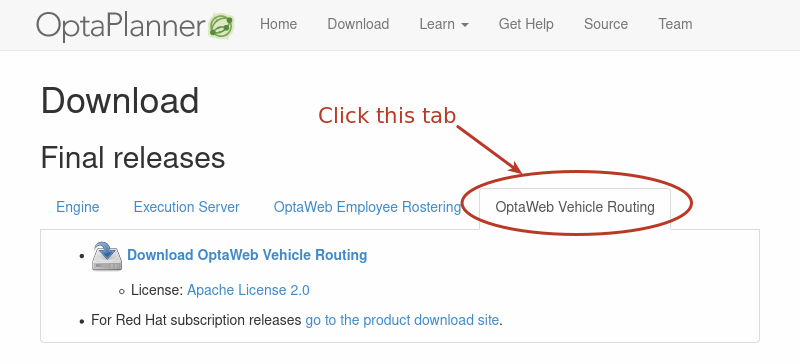
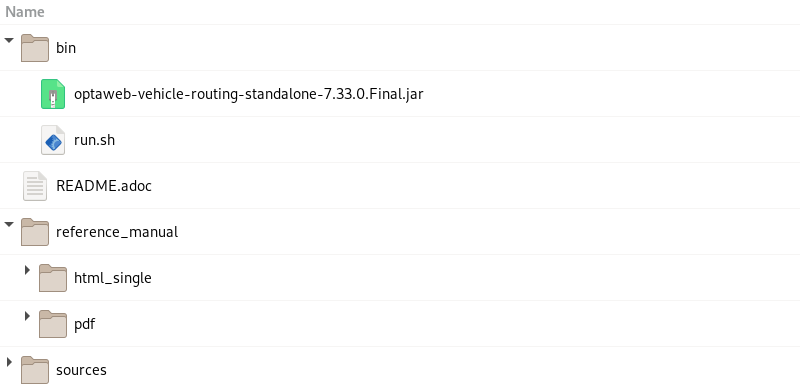

== Quickstart

You can get up and running with OptaWeb Vehicle Routing in just a few steps.

// TODO make this a prerequisite of build procedure
//==== Internet access
//
//You need internet access when you build and run the application.
//The application source code depends on Maven and NPM packages that will be downloaded during build.
//When the application runs it uses third party, public services such as link:https://www.openstreetmap.org/about[OpenStreetMap]
//to display map tiles and provide search results.

=== Download routing data

The routing engine requires geographical data to calculate the time it takes vehicles to travel between locations.
You must download and store OSM (OpenStreetMap) data files on the local file system before you run OptaWeb Vehicle Routing.

NOTE: The OSM data files are typically between 100 MB to 1 GB and take time to download so it is a good idea to download the files before building or starting the OptaWeb Vehicle Routing application.

.Procedure
. Open http://download.geofabrik.de/ in a web browser.
. Click a region in the *Sub Region* list, for example *Europe*.
The sub region's page opens.
. In the *Sub Regions* table, download the OSM file (`.osm.pbf`) for a country, for example Belgium.

=== Create the OptaWeb Vehicle Routing data directory structure

OptaWeb Vehicle Routing reads and writes several types of data on the file system.
It reads OSM (OpenStreetMap) files from the `openstreetmap` directory, writes a road network graph to the `graphhopper` directory, and persists user data in a directory called `db`.
Create a new directory dedicated to storing all of these data to make it easier to upgrade to a newer version of OptaWeb Vehicle Routing in the future and continue working with the data you created previously.

.Procedure
. Create the `openstreetmap` directory in your user account `home` directory, for example:
+
[source]
----
$HOME/.vrp
└── openstreetmap
----

. Move all of your downloaded OSM files (files with the extension `.osm.pbf`) to the `openstreetmap` directory.

The rest of the directory structure will be created by the OptaWeb Vehicle Routing application when it runs for the first time.
After that, your directory structure will look similar to the following example:

// TODO maybe replace this with a screenshot, doesn't look good in PDF.
[source]
----
$HOME/.vrp
├── db
│   └── vrp.mv.db
├── graphhopper
│   └── belgium-latest
└── openstreetmap
    └── belgium-latest.osm.pbf
----

=== Verify the Java version

// TODO Java 11
Java SE 8 or higher must be installed on your system before you can use OptaWeb Vehicle Routing.
It is recommended that you install JDK.
However, if you have a binary distribution of OptaWeb Vehicle Routing, you only need the Java SE Runtime Environment (JRE).
But if you want to build OptaWeb Vehicle Routing from source, your system must have the Java SE Development Kit (JDK).

.Procedure:
. To verify the current Java installation, enter the following command:
+
[source,shell]
----
java -version
----
. If necessary, install OpenJDK 8.
* To install OpenJDK 8 on Fedora, enter the following command:
+
[source,shell]
----
sudo dnf install java-1.8.0-openjdk-devel
----
* To install OpenJDK on other platforms, follow instructions at https://openjdk.java.net/install/.

=== Download OptaWeb Vehicle Routing

Download the OptaWeb Vehicle Routing distribution archive, available from the OptaPlanner website, to quickly evaluate OptaWeb Vehicle Routing without having to set up build tools.

.Prerequisites
* Java 8 or higher is installed.

// TODO cross-reference
NOTE: If you want to modify OptaWeb Vehicle Routing and build it yourself or contribute to upstream, see the Development chapter.

.Procedure
. Go to https://www.optaplanner.org/download/download.html
and click the *OptaWeb Vehicle Routing* tab.
. Click *Download OptaWeb Vehicle Routing <version>*.
+
.OptaPlanner download page

+
. Extract the downloaded distribution ZIP file. The archive contains source files and a binary build of OptaWeb Vehicle Routing as well as the OptaWeb Vehicle Routing documentation.
+
.Content of the OptaWeb Vehicle Routing distribution archive

=== Run OptaWeb Vehicle Routing

After you download OptaWeb Vehicle Routing, use the `run.sh` script to run it.

.Prerequisites
* Internet access is available.
When OptaWeb Vehicle Routing runs it uses third-party public services such as link:https://www.openstreetmap.org/about[OpenStreetMap] to display map tiles and provide search results.
* Java 8 or higher is installed.
* A directory called `openstreetmap` with at least one OSM file exists.
* A country code to use in search queries is identified.

.Procedure
Enter the following command, where `<DATA_DIR>` is the parent of the `openstreetmap` directory, `<COUNTRY>` is the country that you downloaded data for, and `<CODE>` is the code for that country:

[source,bash]
----
./bin/run.sh <DATA_DIR> <COUNTRY>-latest.osm.pbf <CODE>
----

For example, if you want to run OptaWeb Vehicle Routing with Belgium and you downloaded the `belgium-latest.osm.pbf` file from the Geofabrik website and saved it as `~/.vrp/openstreetmap/belgium-latest.osm.pbf`, enter the following command:

[source,bash]
----
./bin/run.sh ~/.vrp/ belgium-latest.osm.pbf BE
----

=== Using air distance mode

OptaWeb Vehicle Routing can work in air distance mode that calculates travel times based on the distance between two coordinates.
Use this mode in situations where you need to get OptaWeb Vehicle Routing up and running as quickly as possible and do not want to use an OSM (OpenStreetMap) file.
Air distance mode is only useful if you need to smoke-test OptaWeb Vehicle Routing and you do not need accurate travel times.

.Prerequisites
* Java 8 or higher is installed.
* OptaWeb Vehicle Routing distribution archive is downloaded and extracted.

.Procedure
. Enter the `run.sh` script without arguments to start OptaWeb Vehicle Routing in air distance mode:
+
[source,bash]
----
./bin/run.sh
----

. When prompted,  confirm that you want to start OptaWeb Vehicle Routing in air distance mode.

=== Building OptaWeb Vehicle Routing

If you do not have an executable distribution of OptaWeb Vehicle Routing,
for example you have just cloned the Git repository from https://github.com/kiegroup/optaweb-vehicle-routing,
you must build OptaWeb Vehicle Routing before you can run it.

.Prerequisites
* You have cloned the OptaWeb Git repository.

.Procedure
. To build OptaWeb Vehicle Routing, change directory to the root of the project with the `mvnw` script file:
+
[source,bash]
----
cd optaweb-vehicle-routing
----

. Build with Maven:
+
[source,bash]
----
./mvnw clean install -DskipTests
----

For more information about building OptaWeb Vehicle Routing, see the Development chapter.
